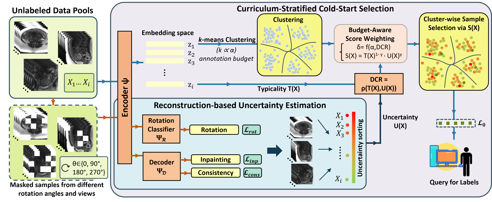

# CSCS-AL: Cold-Start Curriculum Selection for Active Learning

**CSCS** is a dataset-aware method for *cold-start active learning* in 3D medical image
segmentation. Given a fully unlabeled pool, CSCS selects an initial labeled set L₀ by
combining SSL embeddings, typicality, uncertainty, and an adaptive composite score.

> **Paper**: "Dataset-Aware Cold-Start Active Learning for Annotation-Efficient 3D Medical
> Image Segmentation"  
> Rémi Hattat, Marine Beaumont, Charline Bertholdt, Gabriela Hossu, Olivier Morel, Bailiang Chen  
> IADI (U1254), Inserm and Université de Lorraine, Nancy, France  
> *[Citation placeholder — link to be added upon publication]*



---

## 🧠 Method Summary

```
For a pool of N unlabeled volumes and budget B:

1. Extract SSL embeddings z_i, uncertainty U(x), typicality T(x)
2. Compute DCR = Spearman(U, T)               ← dataset characterization
3. Compute alpha_eff = B / sqrt(N)
4. Compute gamma = clip(0.5 + DCR/4 · alpha_eff/(1+alpha_eff), 0.3, 0.7)
5. K-means++ clustering into B clusters        ← diversity
6. Per cluster: x* = argmax S(x)              ← informativeness + representativeness
   where S(x) = T_rank^(1-gamma) · U_rank^gamma
```

Gamma adapts to the dataset structure (DCR) and budget (alpha_eff):
- High DCR (uncertain ≈ atypical) → γ closer to 0.7 → more uncertainty emphasis
- Low/negative DCR → γ closer to 0.3 → more typicality emphasis

---

## ⚙️ Installation

```bash
git clone https://github.com/your-username/cscs-al.git
cd cscs-al

# Core (selection only — no GPU required)
pip install -e .

# Full (SSL extraction + visualization)
pip install -e ".[ssl,viz]"
```

**Requirements**: Python ≥ 3.10, numpy, pandas, scipy, scikit-learn, pyyaml, matplotlib.

---

## 🚀 Quick Start

### From a features CSV (no GPU needed)

```python
from cscs.selection import select_cscs

selection_df, metadata = select_cscs(
    features_csv="data/spleen_ssl_features_train.csv",
    budget=10,
    output_dir="outputs/spleen/cscs_k10/",
    embeddings_dir="data/embeddings/",   # optional but recommended
    seed=42,
)

selected_ids = selection_df[selection_df["selected"]]["volume_id"].tolist()
print(f"Selected: {selected_ids}")
print(f"gamma={metadata['gamma']:.3f}, DCR={metadata['dcr']:+.4f}")
```

### Via CLI

```bash
python scripts/generate_selection.py \
    --features_csv data/spleen_ssl_features_train.csv \
    --embeddings_dir data/embeddings/ \
    --budget 10 \
    --method cscs \
    --output_dir outputs/spleen/cscs_k10_seed42/ \
    --seed 42
```

### Run full experiment (all methods × budgets × seeds)

```bash
python scripts/run_experiment.py \
    --config configs/experiments/example_cscs.yaml
```

---

## 📄 Input CSV Format

Minimum required columns:

```
volume_id, uncertainty, typicality
```

Recommended:
```
volume_id, split, uncertainty, typicality, uncertainty_normalized, typicality_normalized
```

See [docs/data_format.md](docs/data_format.md) for full specification.

---

## 📦 Output Format

Each selection run produces:

| File | Description |
|------|-------------|
| `selected_ids.csv` | Selected volume IDs (one per line) |
| `selection_table.csv` | Full pool ranked by score, with cluster_id and selected column |
| `metadata.json` | gamma, DCR, alpha_eff, seed, budget, n_pool |

---

## 🔀 Available Methods

| Method | Description |
|--------|-------------|
| `cscs` | **CSCS** (this paper) — adaptive gamma composite score |
| `random` | Uniform random sampling |
| `fps` | Farthest Point Sampling (diversity) |
| `typiclust` | K-means + most typical per cluster |
| `probcover` | Greedy max-coverage (ε-ball graph) |
| `csal3d` | CSAL-3D uncertainty-weighted clustering |

---

## 🗄️ Datasets

Budgets correspond to 20% / 30% / 40% of the training pool. DCR is the Difficulty-Coverage
Ratio (Spearman rank correlation between uncertainty and typicality, see paper §2.2).

| Dataset | Modality | Task | N_train | N_val | Classes | Budgets (20/30/40%) | DCR |
|---------|----------|------|---------|-------|---------|----------------------|-----|
| BraTS 2021 (MSD Task01) | Multi-param. MRI (T1, T1ce, T2, FLAIR) | Brain tumor segmentation | 387 | 97 | 3 (whole tumor, tumor core, enhancing tumor) | 77 / 116 / 155 | −0.04 |
| Spleen (MSD Task09) | CT | Spleen segmentation | 34 | 8 | 1 | 7 / 10 / 14 | +0.29 |
| FeTA 2022 | T2-weighted fetal brain MRI | Fetal brain anatomy segmentation | 39 | 10 | 7 | 8 / 12 / 16 | +0.23 |
| DIANE (private, NCT04328532) | T2-weighted fetal MRI (CHRU-Nancy) | Placenta + fetal body segmentation | 18 | 5 | 2 | 5 / 7 / 9 | +0.68 |

### ⬇️ Downloading the Datasets

Public datasets used in this work can be downloaded from their respective official sources:

- **BraTS 2021** and **Spleen (MSD Task09)** are available through the Medical Segmentation
  Decathlon:  
  👉 http://medicaldecathlon.com/

- **FeTA 2022** is available from the Fetal Tissue Annotation challenge:  
  👉 https://fetachallenge.github.io/pages/Data_download.html

> **Note:** DIANE is a private clinical dataset from CHRU-Nancy (trial NCT04328532) and is
> **not publicly available**.

See [docs/reproduce_experiments.md](docs/reproduce_experiments.md) for dataset preparation
and directory layout instructions.

---

## 🔬 SSL Feature Extraction

CSCS requires a 3D SSL feature extractor to compute typicality and uncertainty scores from
the unlabeled pool. Any 3D SSL backbone producing volume-level embeddings is compatible.

### Recommended backbone (used in our experiments)

We use a **ResNet3D pretrained on Kinetics-400** (external, i.e. no medical fine-tuning)
as our primary feature extractor. This is the configuration reported in all paper results.
Extraction scripts and instructions are provided in
[docs/reproduce_experiments.md](docs/reproduce_experiments.md).

### Alternative: CSAL-3D embeddings

The embeddings from **CSAL-3D** ([HiLab-git/CSAL-3D](https://github.com/HiLab-git/CSAL-3D))
are fully compatible with our pipeline and offer a convenient option for direct comparison
with the CSAL-3D baseline (which is included as a built-in method in this repository).

> ⚠️ Note: results may differ from those reported in the paper, which uses the
> Kinetics-400 ResNet3D backbone.

### Other compatible backbones

The following 3D SSL models have also been tested or are straightforward to integrate:

| Backbone | Source | Notes |
|----------|--------|-------|
| ResNet3D (Kinetics-400) | torchvision / torchhub | **Used in paper** |
| Swin-UNETR | [MONAI Model Zoo](https://monai.io/model-zoo) | Medical pretraining |
| MedDINO | [LucasFidon/MedDINO](https://github.com/LucasFidon/MedDINO) | DINO-based, fetal MRI |
| CSAL-3D embeddings | [HiLab-git/CSAL-3D](https://github.com/HiLab-git/CSAL-3D) | Compatible with CSAL-3D baseline |

See `cscs/ssl/` for extraction wrappers and [docs/ssl_backbones.md](docs/ssl_backbones.md)
for integration instructions.

---

## 🗂️ Repository Structure

```
CSCS-AL/
├── cscs/                    ← installable Python package
│   ├── selection/           ← core method (CSCS + baselines)
│   │   ├── cscs.py          ← select_cscs()
│   │   ├── gamma_scheduler.py
│   │   ├── scoring.py
│   │   ├── clustering.py
│   │   ├── baselines.py
│   │   └── registry.py
│   ├── features/            ← typicality, normalization, I/O
│   ├── ssl/                 ← embedding + uncertainty extraction (optional)
│   ├── evaluation/          ← results aggregation
│   ├── visualization/       ← figures
│   └── utils/               ← config, logging, seed, paths
├── scripts/                 ← CLI entry points
├── configs/                 ← YAML configs (datasets, methods, experiments)
├── tests/                   ← unit and integration tests
├── examples/                ← minimal runnable example
└── docs/                    ← method overview, data format, reproduce guide
```

---

## 🧪 Running Tests

```bash
pip install -e ".[dev]"
pytest tests/ -v
```

---

## 📝 Citation

```bibtex
@article{hattat2026cscs,
  title   = {Dataset-Aware Cold-Start Active Learning for
             Annotation-Efficient 3D Medical Image Segmentation},
  author  = {Hattat, Rémi and others},
  journal = {[To be announced]},
  year    = {2026},
}
```

---

## 📜 License

MIT — see [LICENSE](LICENSE).

---

*This repository contains the method implementation only. It does not include
medical imaging datasets, SSL checkpoints, or nnU-Net training results.*